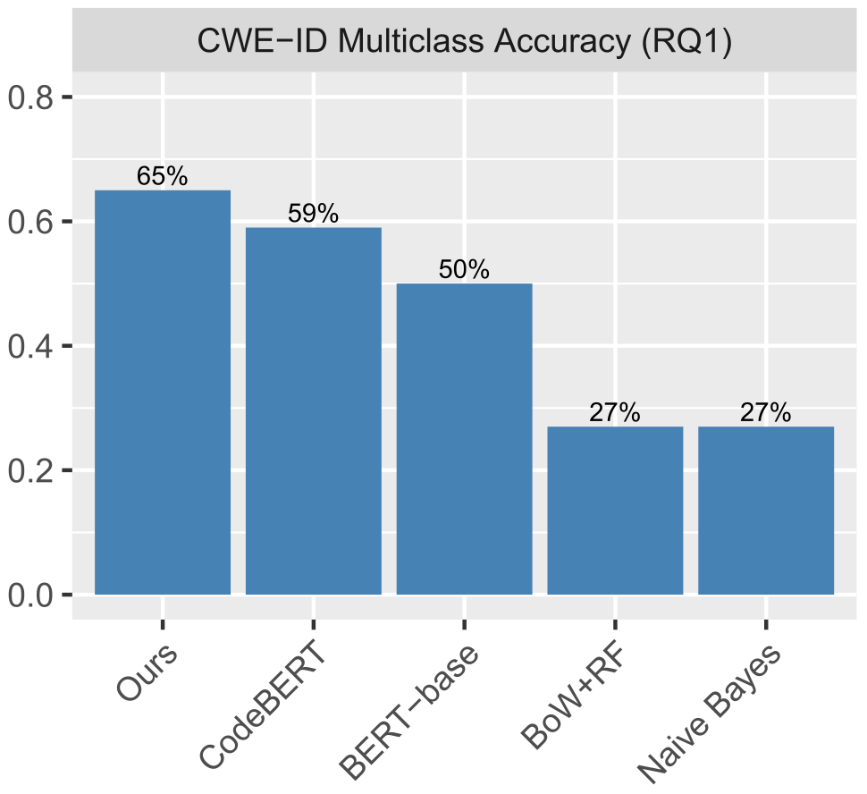
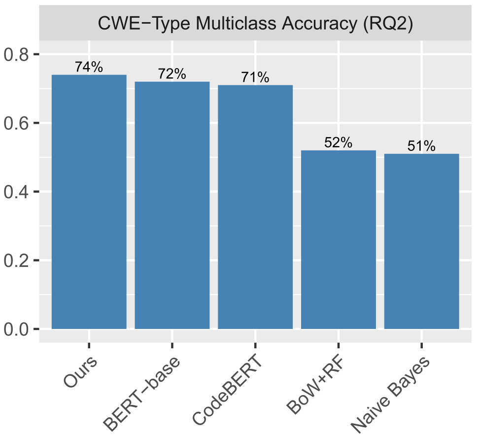
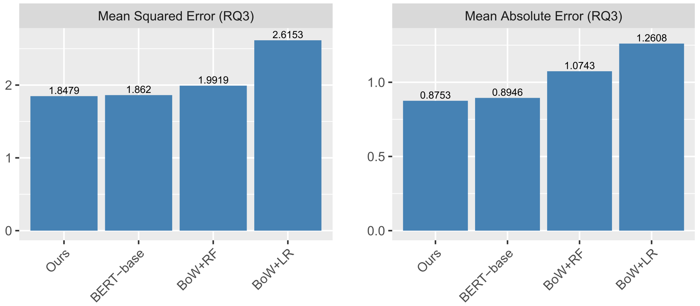

<div align="center">
  
# <a href="https://aibughunter.github.io/">AIBugHunter</a> Replication Package

[](https://www.youtube.com/watch?v=sSV2XjxJfkM "AIBugHunter")

</div>

<p align="center">
  
  </a>
    <div align="center">
    <h4>A Practical Tool for Predicting, Classifying and Repairing Software Vulnerabilities.</h4>
    </div>
</p>

## Table of contents

<!-- Table of contents -->
<details open="open">
  <summary></summary>
  <ol>
    <li>
      <a href="#how-to-replicate">How to replicate</a>
        <ul>
          <li><a href="#about-the-environment-setup">About the Environment Setup</a></li>
          <li><a href="#about-the-datasets">About the Datasets</a></li>
          <li><a href="#about-the-experiment-replication">About the Experiment Replication</a></li>
        </ul>
    </li>
    <li>
      <a href="#acknowledgements">Acknowledgements</a>
    </li>
    <li>
      <a href="#license">License</a>
    </li>
    <li>
      <a href="#citation">Citation</a>
    </li>
  </ol>
</details>

## How to replicate 

  
### About the Environment Setup
<details open="open">
  <summary></summary>
  
First of all, clone this repository to your local machine and access the main dir via the following command:
```
git clone https://github.com/awsm-research/AIBugHunter.git
cd AIBugHunter
```

Then, install the python dependencies via the following command:
```
pip install numpy
pip install torch
pip install transformers
pip install tqdm
pip install pandas
pip install scikit-learn
pip install argparse
pip install gdown
```

Alternatively, we provide requirements.txt with version of packages specified to ensure the reproducibility,
you may install via the following commands:
```
pip install -r requirements.txt
```

If having an issue with the gdown package, try the following commands:
```
git clone https://github.com/wkentaro/gdown.git
cd gdown
pip install .
cd ..
```

* We highly recommend you check out this <a href="https://pytorch.org/">installation guide</a> for the "torch" library so you can install the appropriate version on your device.
  
* To utilize GPU (optional), you also need to install the CUDA library, you may want to check out this <a href="https://docs.nvidia.com/cuda/cuda-quick-start-guide/index.html">installation guide</a>.
  
* <a href="https://www.python.org/downloads/release/python-397/">Python 3.9.7</a> is recommended, which has been fully tested without issues.
 
</details>
  
### About the Datasets
<details open="open">
  <summary></summary>
We use the Big-Vul dataset provided by Fan et al., for more information about the dataset, please refer to <a href="https://github.com/ZeoVan/MSR_20_Code_vulnerability_CSV_Dataset">this repository</a>. 
</div>
</details>

### About the Experiment Replication 
<details open="open">
  <summary></summary>

  We recommend to use **GPU with 8 GB up memory** for training since **BERT architecture is very computing intensive**. 
  
  Note. If the specified batch size is not suitable for your device, 
  please modify **--eval_batch_size** and **--train_batch_size** to **fit your GPU memory.**
  
  First, download the experimental datasets via the following commands:
  ```
  cd data
  sh download_data.sh
  cd ..
  ```
  
### How to reproduce RQ1 (CWE-ID Classification)
#### 1. Our approach (Multi-Objective Optimization)

Run the following command to retrain:
```
cd rq1_cwe_id_cls/mo_bert
sh train.sh
```
Run the following command to run inference using the pre-trained model:
```
cd rq1_cwe_id_cls/mo_bert/saved_models/checkpoint-best-acc
sh download_model.sh
cd ../..
sh test.sh
```

#### 2. CodeBERT

Run the following command to retrain:
```
cd rq1_cwe_id_cls/codebert_base
sh train.sh
```
Run the following command to run inference using the pre-trained model:
```
cd rq1_cwe_id_cls/codebert_base/saved_models/checkpoint-best-acc
sh download_model.sh
cd ../..
sh test.sh
```

#### 3. BERT-base

Run the following command to retrain:
```
cd rq1_cwe_id_cls/bert_base
sh train.sh
```
Run the following command to run inference using the pre-trained model:
```
cd rq1_cwe_id_cls/bert_base/saved_models/checkpoint-best-acc
sh download_model.sh
cd ../..
sh test.sh
```

#### 4. BoW+RF

Run the following command to retrain:
```
cd rq1_cwe_id_cls/bow_rf
python rf_main.py
```
Run the following command to download the pre-trained model:
```
cd rq1_cwe_id_cls/bow_rf/saved_models
sh download_model.sh
```

#### 5. Naive Bayes

Run the following command to retrain:
```
cd rq1_cwe_id_cls/naive_bayes
python naive_bayes_main.py
```
Run the following command to download the pre-trained model:
```
cd rq1_cwe_id_cls/naive_bayes/saved_models
sh download_model.sh
```

<div align="center">
<h3>Expected Results</h3>

</div>


### How to replicate RQ2 (CWE-Type Classification)

#### 1. Our approach (Multi-Objective Optimization)

Run the following command to retrain:
```
cd rq1_cwe_id_cls/mo_bert
sh train.sh
```
Run the following command to run inference using the pre-trained model:
```
cd rq1_cwe_id_cls/mo_bert/saved_models/checkpoint-best-acc
sh download_model.sh
cd ../..
sh test.sh
```
Note. Since our approach is a multi-task learning approach, the model is the same as the one used in RQ1.

#### 2. CodeBERT

Run the following command to retrain:
```
cd rq2_cwe_type_cls/bert_baseline
sh train_codebert.sh
```
Run the following command to run inference using the pre-trained model:
```
cd rq2_cwe_type_cls/bert_baseline/saved_models/checkpoint-best-acc
sh download_model.sh
cd ../..
sh test_codebert.sh
```

#### 3. BERT-base

Run the following command to retrain:
```
cd rq2_cwe_type_cls/bert_baseline
sh train_bert_base.sh
```
Run the following command to run inference using the pre-trained model:
```
cd rq2_cwe_type_cls/bert_baseline/saved_models/checkpoint-best-acc
sh download_model.sh
cd ../..
sh test_bert_base.sh
```

#### 4. BoW+RF

Run the following command to retrain:
```
cd rq2_cwe_type_cls/bow_rf
python rf_main.py
```
Run the following command to download the pre-trained model:
```
cd rq2_cwe_type_cls/bow_rf/saved_models
sh download_model.sh
```

#### 5. Naive Bayes

Run the following command to retrain:
```
cd rq2_cwe_type_cls/naive_bayes
python naive_bayes_main.py
```
Run the following command to download the pre-trained model:
```
cd rq2_cwe_type_cls/naive_bayes/saved_models
sh download_model.sh
```

<div align="center">
<h3>Expected Results</h3>

</div>
    
### How to replicate RQ3 (CVSS Score Regression)
#### 1. Our approach (CodeBERT)

Run the following command to retrain:
```
cd rq3_cvss_score_reg/bert
sh train_codebert.sh
```
Run the following command to run inference using the pre-trained model:
```
cd rq3_cvss_score_reg/bert/saved_models/checkpoint-best-acc
sh download_model.sh
cd ../..
sh test_codebert.sh
```

#### 2. BERT-base

Run the following command to retrain:
```
cd rq3_cvss_score_reg/bert
sh train_bert_base.sh
```
Run the following command to run inference using the pre-trained model:
```
cd rq3_cvss_score_reg/bert/saved_models/checkpoint-best-acc
sh download_model.sh
cd ../..
sh test_bert_base.sh
```

#### 3. BoW+RF

Run the following command to retrain:
```
cd rq3_cvss_score_reg/bow_rf
python rf_main.py
```
Run the following command to download the pre-trained model:
```
cd rq3_cvss_score_reg/bow_rf/saved_models
sh download_model.sh
```

#### 4. BoW+LR

Run the following command to retrain:
```
cd rq3_cvss_score_reg/bow_lr
python lr_main.py
```
Run the following command to download the pre-trained model:
```
cd rq3_cvss_score_reg/bow_lr/saved_models
sh download_model.sh
```

<div align="center">
<h3>Expected Results</h3>

</div>

</details>


## Acknowledgements
* Special thanks to dataset providers of Big-Vul (<a href="https://dl.acm.org/doi/10.1145/3379597.3387501">Fan et al.</a>)

## License 
<a href="https://github.com/awsm-research/AIBugHunter/blob/main/LICENSE">MIT License</a>

## Citation
```bash
@article{fu2024aibughunter,
  title={Aibughunter: A practical tool for predicting, classifying and repairing software vulnerabilities},
  author={Fu, Michael and Tantithamthavorn, Chakkrit and Le, Trung and Kume, Yuki and Nguyen, Van and Phung, Dinh and Grundy, John},
  journal={Empirical Software Engineering},
  volume={29},
  number={1},
  pages={4},
  year={2024},
  publisher={Springer}
}
```
